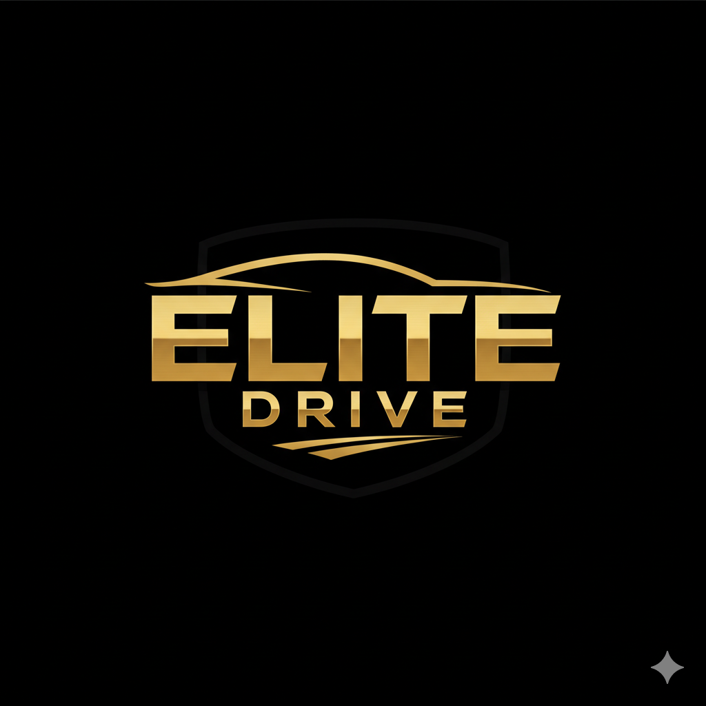

#ELITE DRIVE

<p align="center">

</p>


## 1. About the project

Elite Drive is a comprehensive web platform designed for managing and booking high-end vehicle rentals. The project was launched with the goal of digitizing the rental experience, offering an intuitive customer interface and a robust control panel for fleet management.

The system allows users to register, verify their identity via email, manage their personal profile, and make real-time bookings. Administrators, on the other hand, have tools to monitor vehicle status, manage customers, and validate booking transactions.


## 2. Tech Stack

Main Frameworks and tools:

- **Backend:** [Laravel 11](https://laravel.com/)
- **Frontend:** [Vue.js 3 (Composition API) + Vite](https://vuejs.org/)
- **Frontend:** [Bootstrap v5.3.8](https://getbootstrap.com/)
- **Database:** [Supabase (PostgreSQL)](https://supabase.com/)


## 3. Prerequisites

- PHP 8.2
- Composer
- Node.js & NPM
- Docker


## 4. Installation and Configuration

Steps to clone and launch the project:

1. Clone repository:
```bash git clone https://github.com/your-user/elite-drive.git```
3. Install dependencies PHP:
```composer install```
4. Install dependencies JS:
```npm install```
5. Environment config:
```cp .env.example .env```
6. Key app generation:
```php artisan key:generate```
7. Migrations:
```php artisan migrate --seed```
8. Execute:
```php artisan serve and npm run dev```


## 5. Main Features

- **Auth:** Registration and login with email confirmation via signed URLs.
- **User Profile:** Personal data management with real-time validation.
- **Bookings:** Real-time vehicle availability and booking system.
- **Admin Panel:** Complete CRUD for fleet, bookings, and customer oversight.


## 6. Database Structure

Database schema diagram pending. Built with PostgreSQL on Supabase using Eloquent ORM.

## 7. Authors

- Sergio Libros
- Guillermo Soto
- Iván Requena
