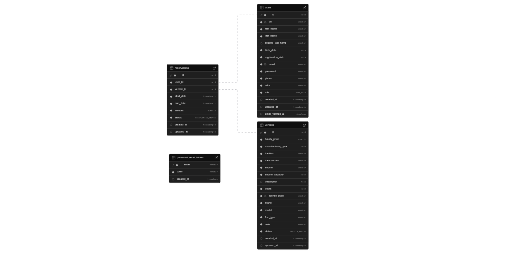

<p align="center">

</p>


## 1. About the project

Elite Drive is a comprehensive web platform designed for managing and booking high-end vehicle rentals. The project was launched with the goal of digitizing the rental experience, offering an intuitive customer interface and a robust control panel for fleet management.

The system allows users to register, verify their identity via email, manage their personal profile, and make real-time bookings. Administrators, on the other hand, have tools to monitor vehicle status, manage customers, and validate booking transactions.


## 2. Tech Stack

Main Frameworks and tools:

- [](https://laravel.com/)
- [](https://vuejs.org/)
- [](https://getbootstrap.com/)
- [](https://supabase.com/)


## 3. Prerequisites

- PHP 8.2
- Composer
- Node.js & NPM
- Docker

## 4. Dependencies

- [Pinia](https://pinia.vuejs.org/) - State Management
- [jsPDF](https://www.npmjs.com/package/jspdf) - PDF generation
- [Swiper](https://swiperjs.com/) - Modern sliders
- [EmailJS](https://www.emailjs.com/) - Email services


## 5. Installation and Configuration

Steps to clone and launch the project:

1. Clone repository:
```bash
git clone https://github.com/SergioLibrosEscuder/elite-drive.git
```
2. Install dependencies for PHP:
``` bash
composer install
```
3. Install dependencies for JS:
```bash
npm install
```
4. Configure the environment:
```bash
cp .env.example .env
```
- (Make sure to configure it correctly) <br><br>

5. Generate the app key
```bash
php artisan key:generate
```
6. Execute:
```bash
php artisan serve
```
```bash
npm run dev
```
- (Execute them in separated terminals)


## 6. Main Features

- **Auth:** Registration and login with email confirmation via signed URLs.
- **User Profile:** Personal data management with real-time validation.
- **Bookings:** Real-time vehicle availability and booking system.
- **Admin Panel:** Complete CRUD for fleet, bookings, and customer oversight.


## 7. Database Structure



## 8. Authors

<div align="center">
  <table>
    <tr>
      <td align="center">
        <a href="https://github.com/SergioLibrosEscuder">
          <br>
          <b>Sergio Libros</b>
        </a>
      </td>
      <td align="center">
        <a href="https://github.com/AlumnoAbastos">
          <br>
          <b>Guillermo Soto</b>
        </a>
      </td>
      <td align="center">
        <a href="https://github.com/IvanRequenaPuig">
          <br>
          <b>Iván Requena</b>
        </a>
      </td>
    </tr>
  </table>
</div>
